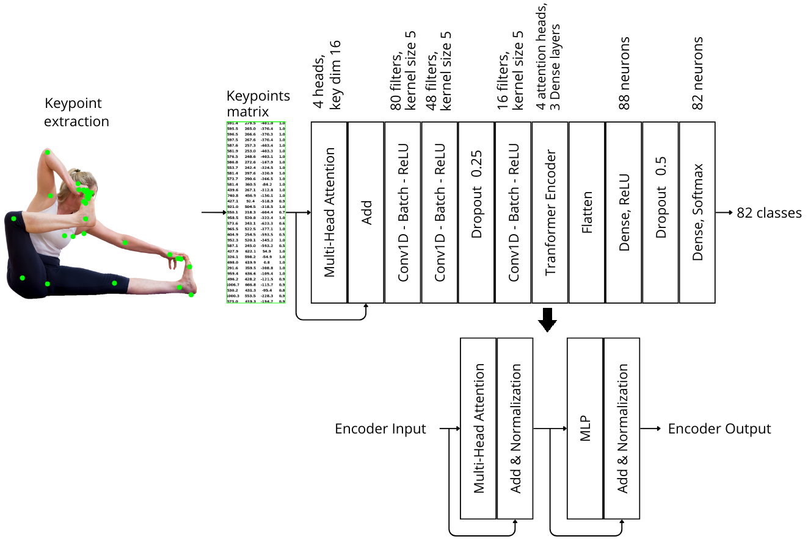

# Lightweight Method for Yoga Posture Recognition

Recognizing the growing importance of yoga for enhancing physical health and mental well-being, this project proposes a lightweight neural network method for the automatic recognition of yoga postures from images. By leveraging skeletal keypoints, our model achieves efficient and accurate posture classification. We evaluated our approach on the Yoga-82 dataset ([Verma et al.](https://sites.google.com/view/yoga-82/home)) using two data augmentation strategies: horizontal flipping of images and data balancing via random Gaussian noise addition combined with keypoint fusion. Our model attains an accuracy of 90.31\% with only 85,582 parameters for 82 distinct yoga postures, demonstrating competitive performance relative to more resource-intensive methods. This efficiency makes the approach particularly suitable for resource-constrained environments, such as smartphones, and paves the way for developing tutor applications that promote individual yoga practice and enhance overall well-being.

Authors: Caio César Macedo Antunes, Rafael Castilho Carvalho, Bernardo Bentes Gatto, Juan Gabriel Colonna.

[Paper link](https://doi.org/10.5753/sbcas.2025.6971)

## Explanations

- **`dataset_gens`:** Contains the codes used to generate the keypoints datasets utilized in this project, all of them based on the Yoga-82 dataset ([Verma et al.](https://sites.google.com/view/yoga-82/home)). If you are not interested in recreating the datasets, you can download them [here](https://drive.google.com/drive/folders/1J22NMrp7-ASANnqbkdPJ8ay9WPHqV_VG?usp=sharing).
- **`experiments`:** Contains the pipeline of `.ipynb` notebooks used in this project for training, testing, and validating the created neural network models. If you want to run the experiments, simply execute the notebooks.
- **`dataset_comparision.txt`:** Contains a comparison of Yoga-82 dataset before and after cleaning using MediaPipe. The reason for this cleaning is that the dataset contains many cartoonish images that would hinder keypoint extraction. Therefore, we used MediaPipe to clean the dataset.
- **`model_tester.py`:** The script that generates the file `prediction_latency.txt`, which contains a prediction latency comparison of our best model against state-of-the-art models ([MobileNetV2](https://paperswithcode.com/method/mobilenetv2) and [Swain et al.](https://www.mdpi.com/1999-4893/15/11/403)) trained on our dataset.

## Description of Datasets and Instructions to Recreate Them

A brief description of each dataset and the steps to recreate them.

### **`kp_ds_not_aug_1`**

- A keypoint dataset generated by extracting keypoints from a cleaned version of the original image dataset, without any data augmentation.

- Extract the directory from the zipped file `img_ds_not_clean_not_aug.zip` into `dataset_gens` directory and execute the following scripts in order:
  1. `img_data_cl.py`
  2. `img_data_redist.py`
  3. `kp_ds_gen.py` (note: change the final directory name to `kp_ds_not_aug_1`)

### **`kp_ds_aug_2`**

- This dataset includes keypoints extracted from images after applying a horizontal flip as a data augmentation technique.

- Based on the already cleaned directory, execute the following scripts in order:
  1. `img_data_aug.py`
  2. `kp_ds_gen.py` (note: change the final directory name to `kp_ds_aug_2`)

### **`kp_ds_aug_balan_3`**

- This dataset is derived from `kp_ds_aug_2` and incorporates additional data augmentation techniques, including Gaussian noise and keypoints mixup, to balance underrepresented classes.

- Based on the already cleaned and horizontally flipped augmented directory, execute the following scripts in order:
  1. `kp_ds_gen.py` (note: change the final directory name to `kp_ds_aug_balan_3`)
  2. `kp_data_aug.py`

## Neural Network Architecture

